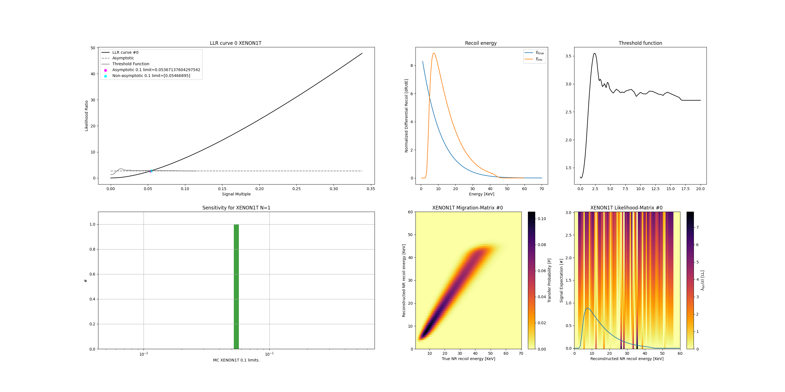

xe-likelihood
-------------

Binwise approximations of the XENON1T likelihood and XENONnT projections for fast inference on arbitrary models.

Example XENON1T based inference

=====
Installation 
=====
In the folder where you've downloaded this repository: 

.. code-block:: python
    
    pip install -e .

Simple example: 

.. code-block:: python

    from xe_likelihood import BinwiseInference, Spectrum

    spectrum = Spectrum.from_wimp(mass=50)
    inference = BinwiseInference.from_xenon1t_sr(spectrum=spectrum)
    inference.plot_summary(show=True)

Will produce something like this:

========
Citation
========

If you use this package, please cite the following papers: 

- the paper describing this method: https://arxiv.org/abs/2210.07231
- the paper for the data used: https://arxiv.org/abs/1805.12562

